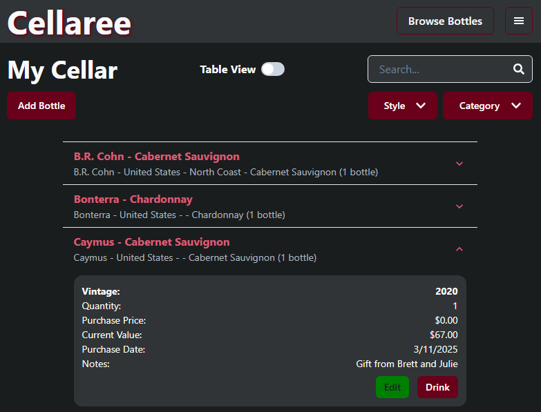
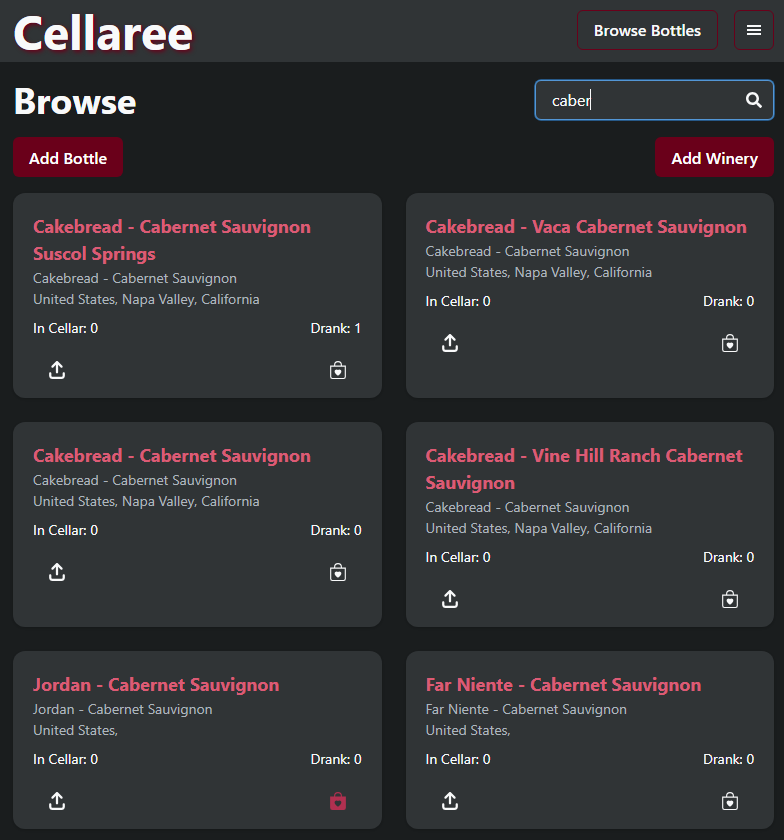
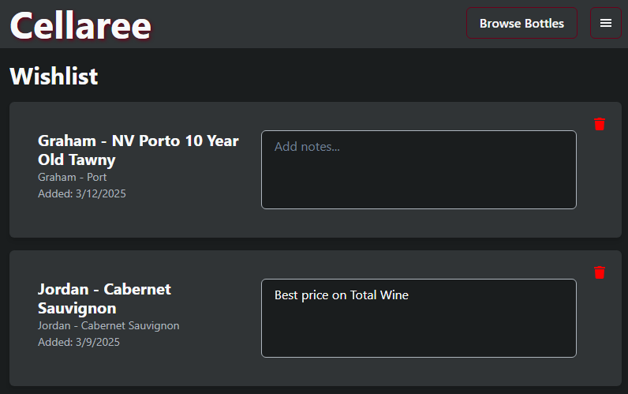

# 🍷 Cellaree

**Cellaree** is a wine cellar tracking app built with the **MERN stack**. It allows users to manage their wine collections, track their drinking history, maintain a wishlist, and leave reviews. The goal is to provide a customizable and user-friendly alternative to commercial cellar management tools.

---

## **🚀 Deployed Application**  
[🔗 https://cellaree.onrender.com](https://cellaree.onrender.com)

---

## 📸 Screenshots

---

## ✨ Features

- **Cellar Management** – Track details about each bottle in your collection including **vintage, quantity, purchase details, and estimated current value**.
- **Drank History** – Log wines that have been consumed for personal tracking.
- **Wishlist** – Save bottles for future purchases.
- **Browse Bottles** – View and search available wines.  Add new bottles and wineries we don't have in our database.
- **Reviews** – Leave ratings and comments on wines you've drank.
- **User Authentication** – Secure login system (email/password-based).
- **Mobile-Friendly** *(Work in progress!)*

---

## 🛠️ Tech Stack

- **Frontend:** React, Apollo Client, Chakra UI
- **Backend:** Node.js, Express, Apollo Server
- **Database:** MongoDB (Atlas)
- **Authentication:** JWT
- **Deployment:** Render

---

## 🔮 Future Development

- **Google SSO**
- **More sorting & filtering options**
- **Image uploads for bottles**
- **More mobile-friendly optimizations.**

---

## **❓ Questions & Contact**  
📌 **GitHub:** [cablej02](https://github.com/cablej02)  
📧 **Email:** [cablej02@gmail.com](mailto:cablej02@gmail.com)  

If you have any questions or feedback, feel free to reach out!